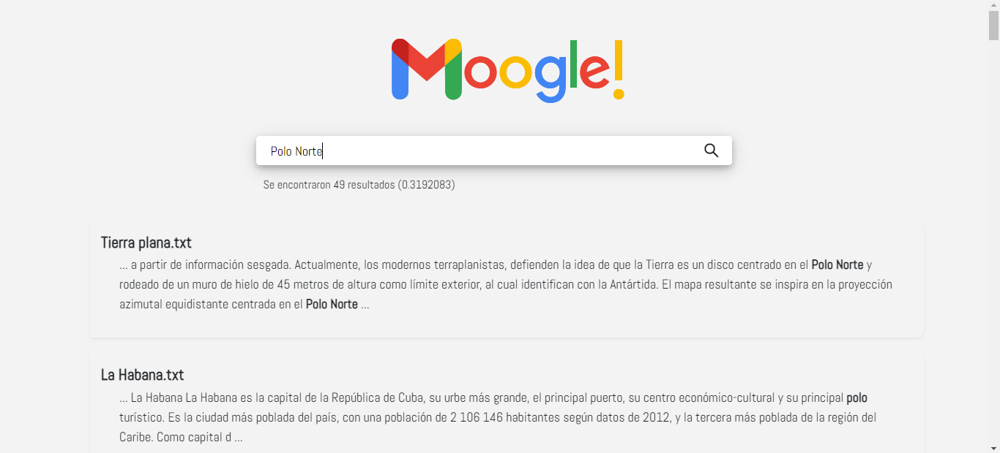

# Moogle 2022

> Proyecto de Programación. Facultad de Matemática y Computación. Universidad de La Habana. Curso 2022.

> Alex Samuel Bas Beovides 

Nuestro proyecto utiliza un modelo vectorial para buscar texto dentro de un corpus de documentos.

# Clases y métodos

Las clases utilizadas son:
- DataSet
    - Add
- Document
    - DocumentToVector
    - ToVector
    - maxFreqFill
- Operators
    - Apply
- Query
    - QueryTfIdf
    - RankDocuments
    - CosineSimilarity
    - PurifyQuery
    - SearchSynonymous
- Snippet
    - RetrieveSnippet
    - retrieveTxtSegment
- TextUtils
    - getDocNames
    - isValidCharacter
    - checkOper
    - normalize
    - EditDistance
    - buildString
- Vector
    - IdfFill
    - ToVectorTfIdf
    - TfIdf
- Moogle
    - init
    - QueryRequest
- SearchItem
- SearchResult

# Flujo de Datos

- ## Precálculo

El programa al levantar hace una llamada al metodo `init()`, donde se realiza un preprocesamiento de todos los documentos que estan en el corpus. Aqui se guarda el .json de los sinonimos en un diccionario, se guardan los documentos como strings en una lista, luego en el método `normalize()` cada uno de estos se separa por palabras y se guardan como una lista de strings. Posteriormente transformamos cada documento en un vector de `n` dimensiones, que vamos a almacenar en arreglos de tipo `double` y tamaño `n`, donde las coordenadas de cada dimension sera la relevancia que tiene cada palabra para el documento. La relevancia es calculada por la siguiente formula:

${{TF_{i,j}} \times {IDF_i}
={ \dfrac{freq_{i,j}}{maxfreq_j}} \times {\log_{10} (\dfrac{N}{df_i})}}$

${freq_{i,j}}=$ cantidad de veces que aparece el termino i en el documento j.

${maxfreq_j}=$ la maxima frecuencia de cualquier termino en el documento j.

$N=$ cantidad total de documentos en el corpus.

${df_i}=$ cantidad de documentos donde aparece el termino i.

 